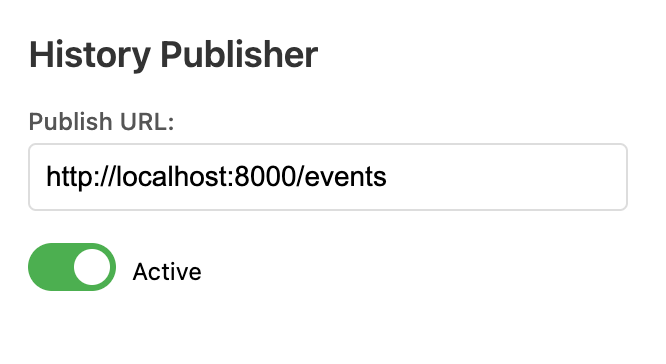

# Chrome History Export

This is a very simple chrome extension which lets one configure a backend URL to which navigation events along with "tab switching" events are sent to.

The payload of events is of the form

``` typescript
{
  type: "navigation_completed" | "tab_activated",
  url: string,
  tabId: number,
  timestamp: Date,
  user: string
}
```

The configuration is done within the extension's action popup:



## Backend Server

I use [this very simple http server](https://github.com/Jef808/chrome-ext-export-history) as the backend for this extension. Feel free to use it as is or to use it as a base for your own needs.
